<div align="center">

# 🔐 PASSWORD CRACKING

**W3-PM-FINAL | CYBERSECURITY |  NETWORKWALKS**
</div>

<p align="center">
  
  
  
  
  
  
  
  
  
  
  
  
  
</p>

---

## Project Overview

This project is part of my Internship at `Networkwalks`, week 3 focusing on password security and techniques to retrive password.The tools and techniques are used is `John The Ripper (JTH)` and it graphic tool `johnny`, Also used the `Networkwalks` tools `Hash Calculator` and `Password Cracker`.

The main objective is to retive the password of protected files 

## Objectives

- Understand how password-protected files store password hashes.
- Extract a password hash from an encrypted PDF file.
- Use `pdf2john` helper and `Networkwalks Hash Calculator` to extract the hashes
- Use **Johnny GUI** to interact with John the Ripper more easily.
- Use `Networkwalks Password Cracker` to cracked the passord.
- Understand the relationship between password complexity and cracking time.
- Demonstrate why strong passwords are essential for security.

## Tools & Technologies

| Tool                                            | Purpose                                             |
| ----------------------------------------------- | --------------------------------------------------- |
| **John the Ripper (JTR)**                       | Password hash cracking and password recovery        |
| **Johnny**                                      | Graphical interface for John the Ripper             |
| **Kali Linux**                                  | Testing environment                                 |
| **pdf2john**                                    | Extracting the password hash from the protected PDF |
| **Networkwalks Hash Calculator**                | Extracting the password hash from the protected PDF |
| **Networkwalks Password Cracker**               | Password hash cracking and password recovery        |

## Methodology

### 1. Installing John the Ripper

For Kali Linux users, John the Ripper is available directly as part of the default security-testing toolkit.

### 2. Installing and Configuring Johnny

For kali linux which is debian based system you can do the following steps:

```sh
sudo apt update
sudo apt-get install g++ git qtbase5-dev
git clone https://github.com/shinnok/johnny.git && cd johnny
git checkout v2.2
export QT_SELECT=qt5
qmake && make -j$(nproc)
./johnny
```
### 3. Extracting the PDFs Hash

#### pdf2john tool

There are three password-protected PDFs as target files for this lab

The three PDF hashes were extracted by the tool helper `pdf2john` and saved to file by the following commands:

```sh
pdf2john My\ Locked\ PDF1.pdf > hash1.txt
pdf2john My\ Locked\ PDF2.pdf > hash2.txt
pdf2john My\ Locked\ PDF1.pdf > hash3.txt
```
Hashes were verified to ensure that unnecessary characters were removed and that they were stored in the correct format for John the Ripper.

#### Networkwalks Hash Calculator

Or we can used the `Networkwalks Hash Calculator` tool to extracted the hashes for the three PDFs and copy them.

### 4. Loading the Hash

#### Johnny 

Hashes `hash1.txt`, `hash2.txt`, and `hash3.txt` was loaded in johnny using the option `the **Open Password File** option.`

#### Networkwalks Password Cracker

By coping the hashes one by one and paste it in th `Networkwalks Password Cracker` tool we will get the cracked passord.

### 5. Password Recovery

The two tools recoverd the password hashes, but for recovering we need to consider these things for thtime that it will be taking for recovering:

* Password complexity
* Password length
* Available wordlists
* Attack methodology
* CPU performance
* Number of possible password combinations

Once the password was successfully recovered, it was used to unlock the protected PDF.

##  Key Cybersecurity Concepts Learned

### Password Hashing

A password hash is a one-way representation of a password. Instead of storing the original password directly, systems can store its hash.

However, weak passwords can potentially be recovered through password-cracking techniques.

### Password Cracking

Password cracking involves attempting to discover the original password from a password hash.

Tools such as John the Ripper can automate this process using different attack techniques.

### Password Complexity

The lab demonstrated the importance of password complexity. Short and predictable passwords are significantly easier to recover than long, random passwords.

### Security Awareness

The exercise highlighted why organizations should implement:

* Strong password policies
* Long and complex passwords
* Multi-factor authentication (MFA)
* Secure password hashing algorithms
* Account lockout and rate-limiting mechanisms
* Regular security assessments


## Example Workflow

```text
Protected PDF
     │
     ▼
Extract PDF Hash
     │
     ▼
Save Hash → hash1.txt
     │
     ▼
Load Hash into Johnny
     │
     ▼
Start Password Attack
     │
     ▼
Password Recovered
     │
     ▼
Unlock Protected PDF
```


##  Skills Developed

Through this project, I developed practical knowledge in:

* Password security
* Hash analysis
* Password recovery
* John the Ripper
* Johnny GUI
* PDF password protection
* Cybersecurity laboratory methodologies
* Security assessment techniques
* Understanding password vulnerabilities


##  Ethical & Legal Considerations

This activity was performed strictly for **educational and cybersecurity training purposes** within an authorized laboratory environment.

Password-cracking tools should only be used against systems, files, or hashes for which explicit authorization has been obtained.

Unauthorized password cracking or access to protected information may violate organizational policies and applicable laws.


## Project Outcome

Successfully completed a practical password-security exercise using **John the Ripper, Johnny,Networkwalks Password Cracker**, gaining hands-on experience in extracting password hashes, performing controlled password-recovery attacks, and understanding the security implications of weak passwords.

This project strengthened my practical understanding of **offensive security techniques and defensive password-security practices** as part of my Cybersecurity Internship at **Networkwalks**.

## Evidences Collected

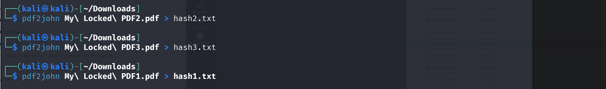

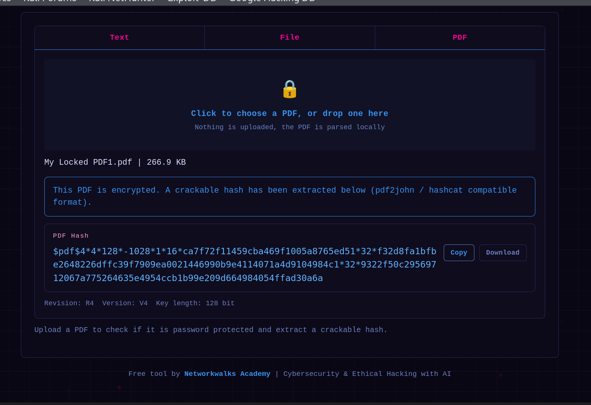

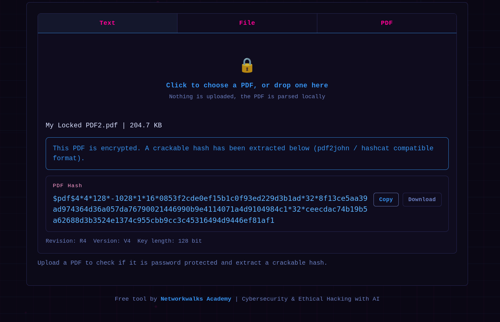

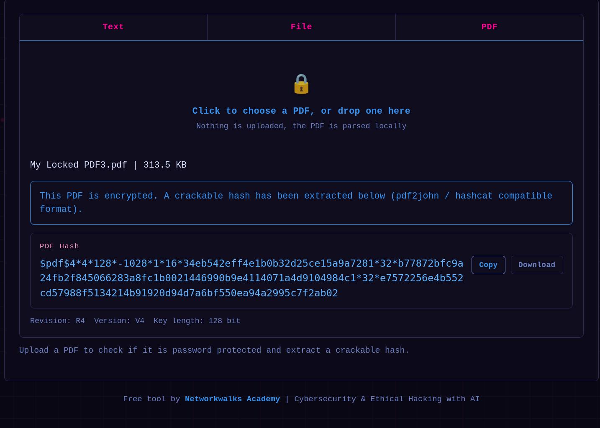

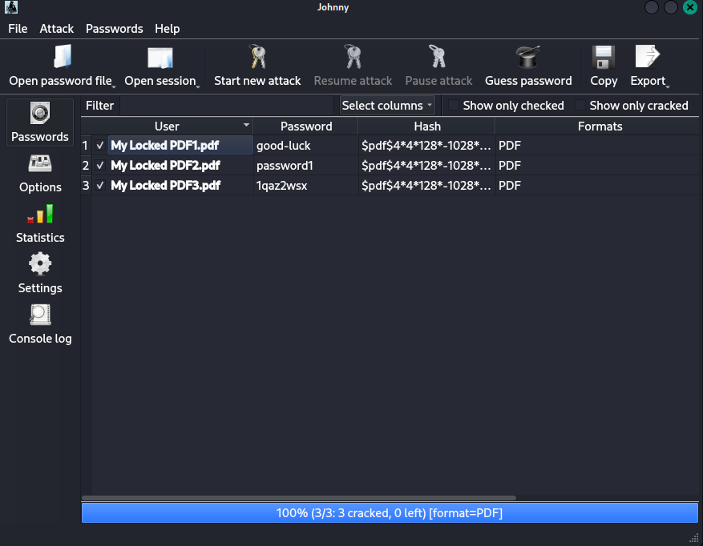

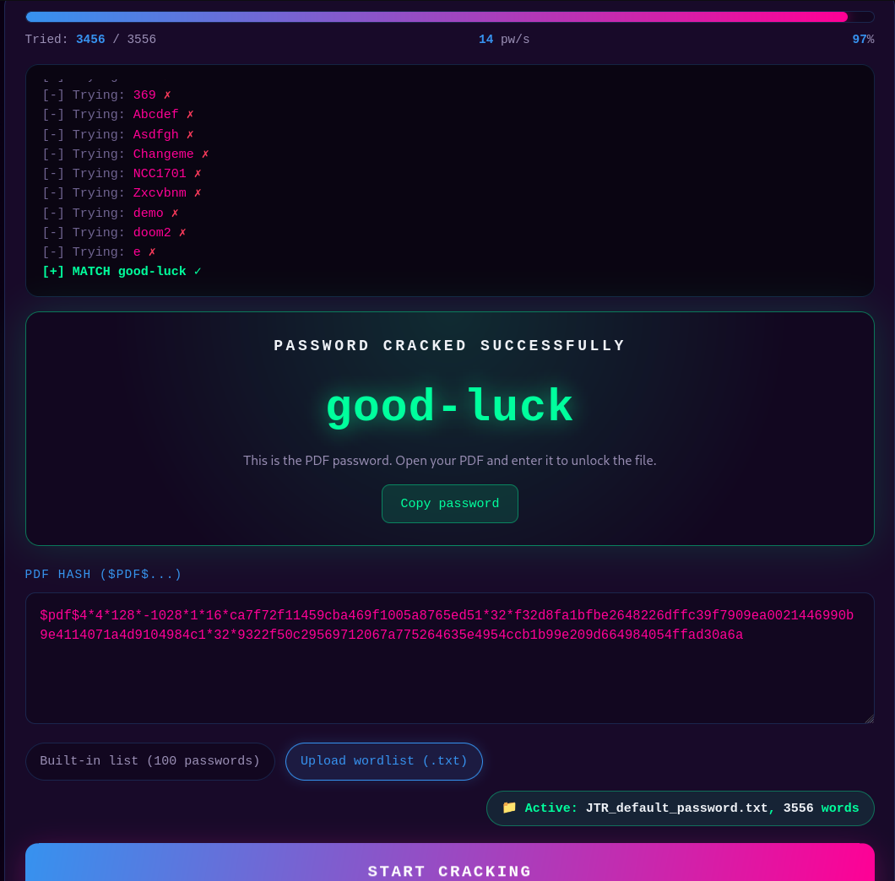

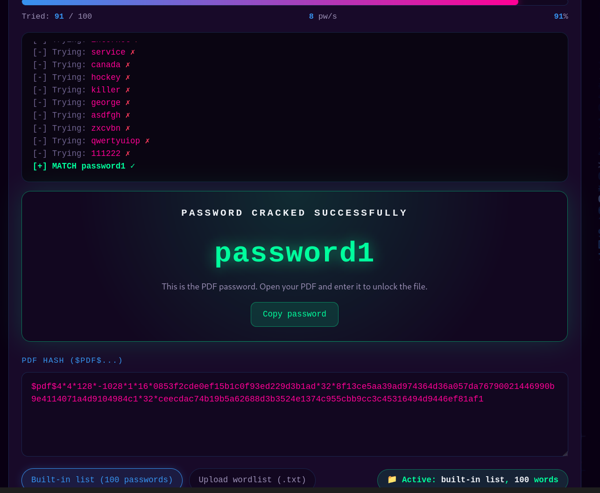

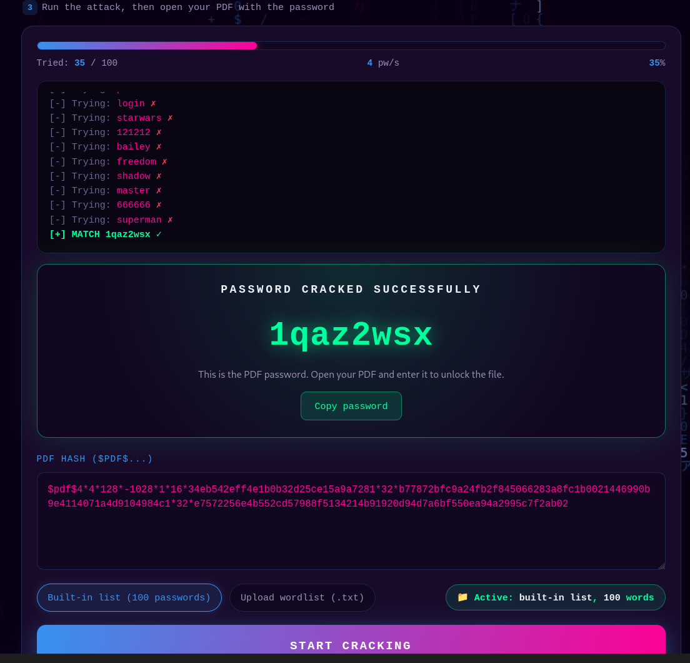

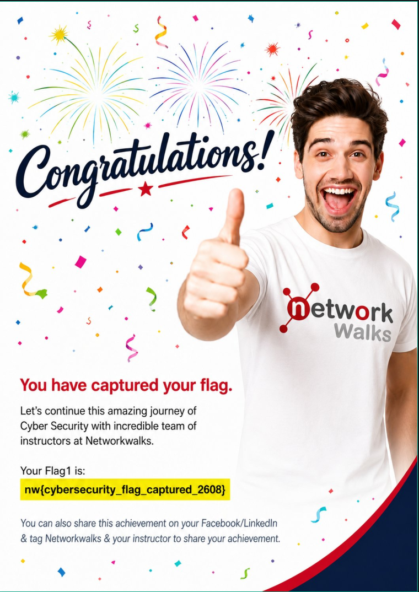

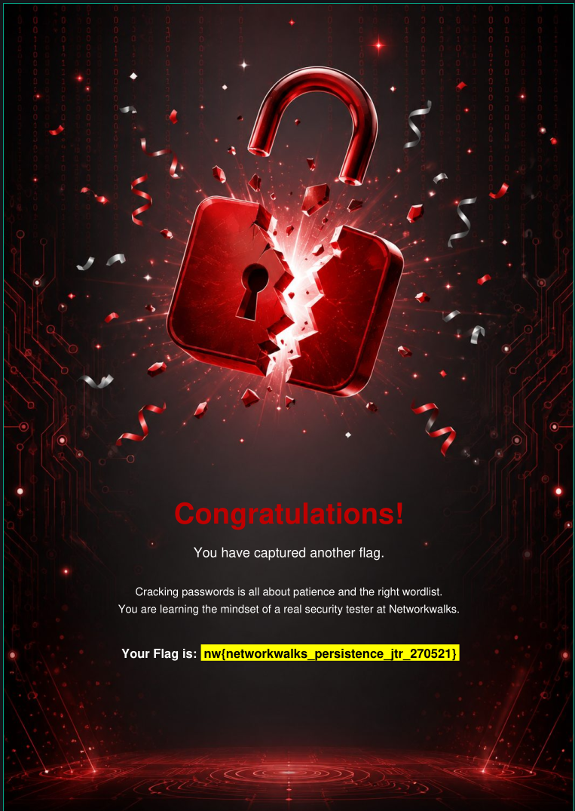

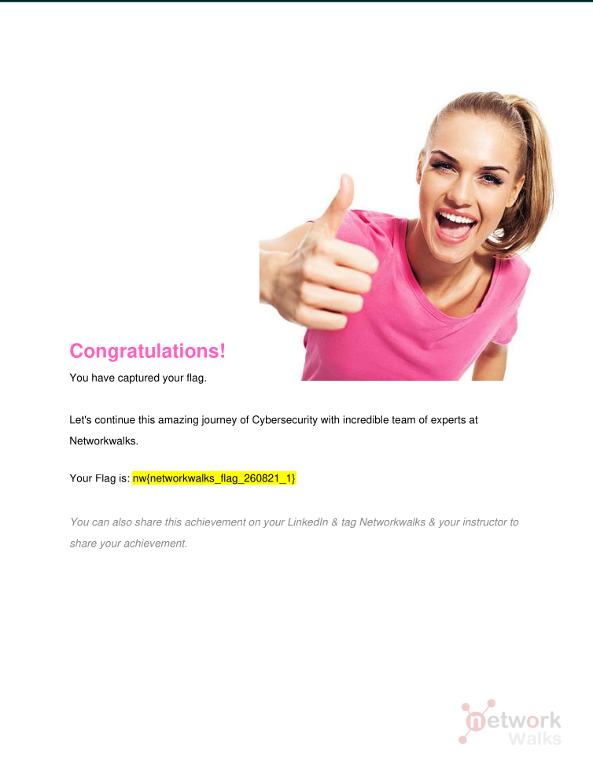

#  Author

**Mustafa Hagibrahim**\
Cybersecurity Professional B083

LinkedIn: [www.linkedin.com/in/mustafa-hagibrahim-39179b231](www.linkedin.com/in/mustafa-hagibrahim-39179b231)


##  Project Information

**Program Name:** Cybersecurity at Networkwalks | **Week:** 03 | **Project:** Password Cracking | **Repository:** GitHub